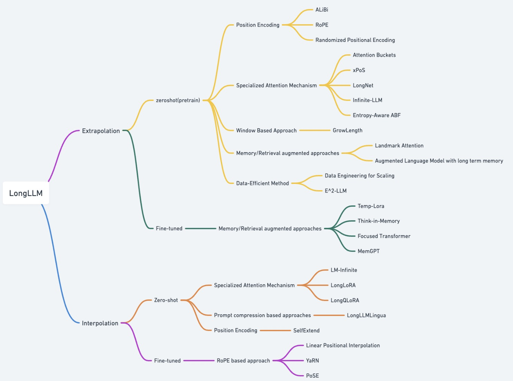

 

[[Twitter Follow]](https://twitter.com/ZhiyuanCS)

  

# LongLLM-Extrapolation

LongLLM-Extrapolation. Updated daily
- [Research papers.](#papers)
- [What is LLM Extrapolation (long-context generation)?](https://chat.openai.com/share/7d0dce43-d1d1-4f09-92d7-7a7f6525161b)

---

 
  

#### 18 Feb 2024 

[LongAgent: Scaling Language Models to 128k Context through Multi-Agent Collaboration]

- Author: Jun Zhao, Can Zu, Hao Xu, Yi Lu, Wei He, Yiwen Ding, Tao Gui, Qi Zhang, Xuanjing Huang (Fudan University)
- TL.DR: The paper introduces LongAgent, a novel approach using multi-agent collaboration to extend the context handling capabilities of LLMs like LLaMA to 128k tokens, surpassing traditional models like GPT-4 in long-text processing tasks. By employing a leader to direct team members in gathering information and an inter-member communication mechanism to resolve inconsistencies caused by hallucinations, LongAgent demonstrates significant improvements in long-text retrieval and multi-hop question answering. This method presents a promising solution for efficiently processing extensive text inputs while addressing the challenges of high training costs and inference latency in LLMs.
---

#### 15 Feb 2024

[Data Engineering for Scaling Language Models to 128K Context](https://arxiv.org/abs/2402.10171)

- Author: Yao Fu(University of Edinburgh), Rameswar Panda(MIT-IBM Watson AI Lab), Xinyao Niu(University of Melbourne), Xiang Yue(Ohio State University), Hannaneh Hajishirzi(University of Washington), Yoon Kim(MIT), Hao Peng(UIUC)
- TL.DR: The study explores the effectiveness of continual pretraining for extending the context length of language models to 128K, emphasizing the importance of data engineering in terms of both quantity and quality. It finds that training on 500 million to 5 billion tokens, with a focus on domain balance and avoiding naive length upsampling, enables models to effectively utilize information across extended contexts. This approach, which is both effective and affordable, outperforms existing long-context models and narrows the performance gap with state-of-the-art models like GPT-4 128K.
---

#### 21 Jan 2024

[With Greater Text Comes Greater Necessity: Inference-Time Training Helps Long Text Generation]()
- Author: Y. Wang, D. Ma, D. Cai
- TL.DR: The proposed Temp-Lora method enhances long text generation, like novel writing or extensive translations, by embedding context information into a temporary module within the model's parameters, instead of using traditional memory-intensive methods. This innovative approach allows for high-quality text generation with significantly reduced hardware demands. It demonstrated impressive improvements in benchmarks, including lower perplexity and higher BLEU scores, while also cutting down computational costs and speeding up the process. Temp-Lora stands out by being efficient, compatible with existing methods, and effective in handling long texts without permanent changes to the model's structure.

#### 15 Jan 2024

[The What, Why, and How of Context Length Extension Techniques in Large Language Models -- A Detailed Survey](https://arxiv.org/abs/2401.07872)

- Author: Saurav Pawar (Technology Innovation Institute, UAE), S.M Towhidul Islam Tonmoy(Islamic University of Technology, Bangladesh), S M Mehedi Zaman(Islamic University of Technology, Bangladesh), Vinija Jain(Stanford University & 4Amazon GenA), Aman Chadha (Stanford University & 4Amazon GenA), Amitava Das(AI Institute, University of South Carolina)
- TL.DR: The survey paper discusses the importance and challenges of extending context length in LLMs for improving NLP applications. It highlights the need to overcome LLMs' limitations in handling long text sequences for better comprehension and generation capabilities. The paper reviews existing strategies for context length extension, evaluates their effectiveness, and addresses the lack of consensus on evaluation standards among researchers. It aims to guide researchers in understanding context extension techniques and encourages further exploration and standardization efforts in this evolving area.
---

#### 15 Jan 2024

[Flexibly Scaling Large Language Models Contexts Through Extensible Tokenization](https://arxiv.org/abs/2401.07793)

- Author: 
- TL.DR: 
---

#### 13 Jan 2024

[E^2-LLM: Efficient and Extreme Length Extension of Large Language Models](https://arxiv.org/abs/2401.06951)

- Author: Jiaheng Liu(Alibaba Group), Zhiqi Bai(Alibaba Group), Yuanxing Zhang(Alibaba Group), Chenchen Zhang(Alibaba Group), Yu Zhang(Alibaba Group), Ge Zhang(University of Waterloo), Jiakai Wang(Alibaba Group), Haoran Que(Alibaba Group), Yukang Chen(The Chinese University of Hong Kong), Wenbo Su(Alibaba Group), Tiezheng Ge(Alibaba Group), Jie Fu(The Hong Kong University of Science and Technology), Wenhu Chen(University of Waterloo), Bo Zheng(Alibaba Group)
- TL.DR: The paper proposes E^2-LLM, an efficient method for extending the context length of LLMs without the need for long-context training data or high computational costs. By using short training sequences (e.g., 4k tokens) and a single training procedure, E2-LLM enables LLMs to handle various context lengths at inference time efficiently. It incorporates novel augmentation methods based on RoPE (Rotary Position Embeddings) to enhance model robustness to different context lengths. The approach significantly reduces the computational requirements and demonstrates its effectiveness across multiple benchmark datasets for long-context tasks.
---

#### 13 Jan 2024

[Extending LLMs' Context Window with 100 Samples](https://arxiv.org/abs/2401.07004)

- Author: 
- TL.DR: 
---

#### 7 Jan 2024

[Infinite-LLM: Efficient LLM Service for Long Context with DistAttention and Distributed KVCache](https://arxiv.org/abs/2401.02669) [Code]()

- Author: 
- TL.DR: 
---

#### 2 Jan 2024

[LLM Maybe LongLM: Self-Extend LLM Context Window Without Tuning](https://arxiv.org/abs/2401.01325) [Code](https://github.com/datamllab/LongLM)
- Author: Hongye Jin(Texas A&M University), Xiaotian Han(Texas A&M University), Jingfeng Yang(Amazon), Zhimeng Jiang(Texas A&M University), Zirui Liu(Rice University), Chia-Yuan Chang(Texas A&M University), Huiyuan Chen(Case Western Reserve University), Xia Hu(Rice University)
- TL.DR: The work introduces SelfExtend, a novel method that leverages existing Large Language Models' (LLMs) inherent capabilities to handle longer contexts than they were trained for, without the need for fine-tuning. SelfExtend utilizes a bi-level attention mechanism—grouped attention for distant token dependencies and neighbor attention for adjacent token relationships—built on the original self-attention mechanism to extend LLMs' context window effortlessly during inference. The approach requires minimal code adjustments and has been proven effective across various benchmarks, enabling LLMs to process longer input sequences efficiently.
---

#### 8 Nov 2023

[LongQLoRA: Efficient and Effective Method to Extend Context Length of Large Language Models](https://arxiv.org/abs/2311.04879)
- Author: Jianxin Yang (Sun Yat-sen University)
- TL.DR: LongQLoRA is a method designed to extend the context lengths of large language models like LLaMA2 efficiently, using fewer training resources. It integrates Position Interpolation, QLoRA, and the Shift Short Attention mechanism from LongLoRA to effectively increase context lengths from 4096 to up to 12,000 tokens on a single 32GB V100 GPU within just 1000 fine-tuning steps. LongQLoRA shows strong performance on the PG19 and Proofpile datasets, surpassing LongLoRA and closely matching the performance of MPT-7B-8K for context lengths of 8192. It also successfully extends the context length of Vicuna-13B models, demonstrating improved generation quality in both long and short contexts. Ablation studies further explore the impact of LoRA rank, fine-tuning steps, and attention patterns during inference, contributing to our understanding of efficient context extension in language models.

#### 10 Oct 2023
[LongLLMLingua: Accelerating and Enhancing LLMs in Long Context Scenarios via Prompt Compression](https://arxiv.org/abs/2310.06839)
- Author: Huiqiang Jiang, Qianhui Wu, Xufang Luo, Dongsheng Li, Chin-Yew Lin, Yuqing Yang, Lili Qiu (Microsoft)
- TL.DR: LongLLMLingua is a strategy aimed at optimizing large language models (LLMs) for long context scenarios through prompt compression. It addresses the challenges of high computational costs, long latency, and reduced performance by enhancing the models' ability to focus on key information within the prompts. Through evaluations across various applications, including QA, few-shot learning, summarization, and more, LongLLMLingua has been shown to significantly improve performance and reduce both costs and latency. Notably, it achieved a performance increase of up to 17.1% with around four times fewer tokens needed for input in benchmarks like GPT-3.5-Turbo, alongside notable cost savings and speed improvements in processing times.

#### 8 Oct 2023

[Scaling Laws of RoPE-based Extrapolation](https://arxiv.org/abs/2310.05209)
- Author: Xiaoran Liu, Hang Yan, Shuo Zhang, Chenxin An, Xipeng Qiu, Dahua Lin (Fudan University, Shanghai AI lab)
- TL.DR: This work investigates the extrapolation capabilities of Large Language Models (LLMs) using Rotary Position Embedding (RoPE) and proposes a novel framework, the Scaling Laws of RoPE-based Extrapolation, to improve these capabilities. By adjusting the rotary base value and the context length used in fine-tuning, the authors found significant enhancements in the models' ability to handle much longer texts than seen during training, achieving extrapolation up to 1 million tokens with only 16K training length on LLaMA2 models. This study offers a comprehensive understanding of how RoPE's parameters influence LLMs' extrapolation performance and presents a methodological approach to extend their application range significantly.
---

#### 21 Sep 2023

[LongLoRA: Efficient Fine-tuning of Long-Context Large Language Models](https://arxiv.org/abs/2309.12307)
- Author: Yukang Chen(CUHK), Shengju Qian(CUHK), Haotian Tang(MiT), Xin Lai(CUHK), Zhijian Liu(CUHK), Song Han(MIT, NVIDIA), Jiaya Jia(CUHK)  
- TL.DR: LongLoRA is a novel fine-tuning method designed to efficiently extend the context sizes of pre-trained large language models (LLMs) without significantly increasing computational costs. It introduces two main improvements: the shifted sparse attention (S2-Attn) mechanism for efficient fine-tuning with sparse local attention, saving computation during the context extension process, and an optimized version of LoRA (Low-Rank Adaptation) that focuses on trainable embeddings and normalization for parameter-efficient fine-tuning. This approach allows for extending the context size of models like Llama2 from standard lengths to up to 100,000 tokens with minimal computational overhead, demonstrating strong performance on various tasks. LongLoRA maintains the original architecture of the models and is compatible with existing techniques, offering a practical solution for enhancing LLMs' ability to handle longer contexts effectively.

#### 19 Sep 2023

[PoSE: Efficient Context Window Extension of LLMs via Positional Skip-wise Training](https://arxiv.org/abs/2309.10400) [Code](https://github.com/google-deepmind/randomized_positional_encodings)
- Author: Dawei Zhu(Peking University & Microsoft Corporation), Nan Yang(Microsoft Corporation), Liang Wang(Microsoft Corporation), Yifan Song(Peking University), Wenhao Wu(Peking University), Furu Wei(Microsoft Corporation), Sujian Li(Peking University)
- TL.DR: The paper introduces Positional Skip-wisE (PoSE) training, a novel method for extending the context length of Large Language Models (LLMs) without the need for intensive Full-length fine-tuning. PoSE cleverly simulates longer inputs within a fixed context window by dividing it into chunks and applying distinct skipping bias terms to manipulate each chunk's position indices. This technique allows the model to adapt to any position within the target length efficiently, significantly reducing memory and time costs. The authors successfully extended the LLaMA model to handle 128k tokens using only a 2k training context window and demonstrated PoSE's compatibility with RoPE-based LLMs and position interpolation strategies. This method opens the possibility of scaling LLMs to potentially infinite lengths, bounded only by inference memory constraints.
---

#### 26 May 2023

[Randomized Positional Encodings Boost Length Generalization of Transformers](https://arxiv.org/abs/2305.16843) [Code](https://github.com/google-deepmind/randomized_positional_encodings)
- Author: Anian Ruoss, Grégoire Delétang, Tim Genewein, Jordi Grau-Moya, Róbert Csordás, Mehdi Bennani, Shane Legg, Joel Veness (DeepMind. The Swiss AI Lab, IDSIA, USI & SUPSI.)
- TL.DR: This work identifies the failure of Transformers to generalize to sequences of arbitrary length as a problem rooted in positional encodings being out-of-distribution for longer sequences. To address this, the authors introduce a novel randomized positional encoding scheme designed to simulate longer sequence positions, allowing the model to generalize to unseen sequence lengths more effectively. Their extensive evaluation across 6000 models and 15 tasks shows a significant improvement in generalization capabilities, with an average increase of 12.0% in test accuracy for sequences longer than those seen during training.
---

#### 11 Jul 2022

[Exploring Length Generalization in Large Language Models](https://arxiv.org/abs/2207.04901) 
- Author: Cem Anil, Yuhuai Wu, Anders Andreassen, Aitor Lewkowycz, Vedant Misra, Vinay Ramasesh, Ambrose Slone, Guy Gur-Ari, Ethan Dyer, Behnam Neyshabur (Google )
- TL.DR: This paper explores the ability of transformer-based language models to generalize from short to longer problem instances in reasoning tasks, an important aspect of out-of-distribution generalization. Through empirical studies, the authors find that simply fine-tuning transformers on tasks requiring length generalization leads to significant deficiencies, regardless of the model's size. However, they discover that leveraging the in-context learning capabilities of pretrained large language models, combined with scratchpad prompting (which involves asking the model to outline solution steps before providing the final answer), significantly enhances length generalization capabilities. The study also conducts failure analyses to identify common mistake patterns, suggesting pathways for future improvements in enabling language models to handle longer and more complex problem instances effectively.
---

